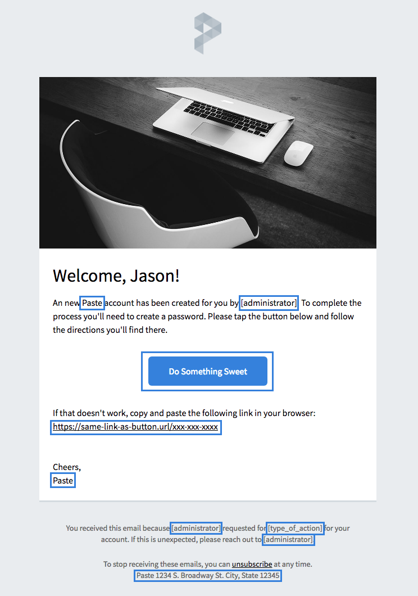
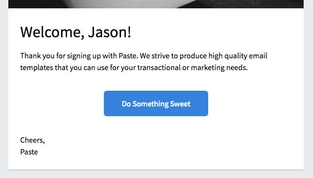
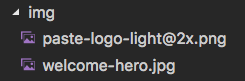

# Use Cases

## Using one of the Templates

To use a Sendgrid email template, select the document(s) to be used and identify the placeholder text to change. For example, it is recommended to update the following on welcome.html:

* words that appear between square brackets
* the link and text for the call to action button
* the backup link included in case the button fails
* the address provided at the bottom of the template
* the type of account and sign-off name (both "Paste" in the example image)

These are all shown inside blue rectangles here:

Other text can also be changed, as in this image of admin-created-account-welcome.html:

To update the logo or hero image, navigate to the img directory within the directory of the chosen template, and replace the corresponding images found there. These are the file names in the case of the welcome.html example:

* paste-logo-light@2x.png
* welcome-hero.jpg

